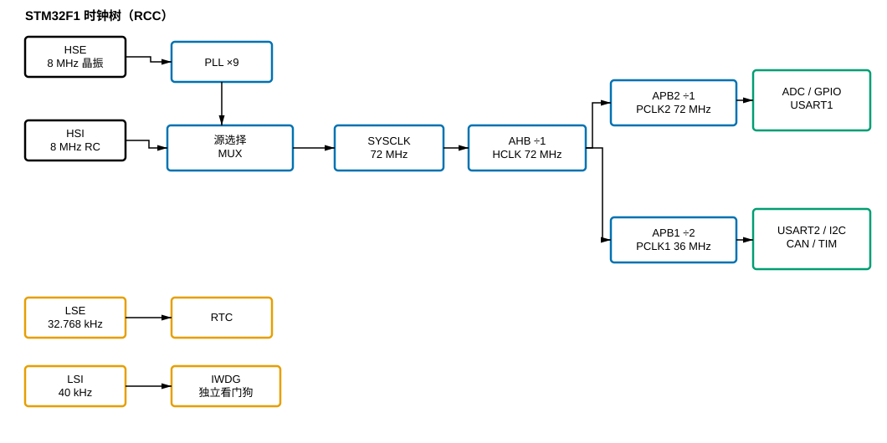

# 001 时钟系统 RCC：芯片的心脏节拍

> [!info] 笔记定位
> 从一个"芯片为什么要有一堆时钟、它们怎么从源头一路派发到每个外设"的角度，串起 [[时钟系统 RCC]] 概念下的 [[时钟源]]、[[PLL 锁相环倍频]]、[[时钟树与源选择]]、[[AHB APB 分频总线]]、[[外设时钟门控使能]] 五个原子点。落地到 STM32F1（72MHz 口径）。

## 用到的原子点（按顺序）

1. [[时钟源]] —— 节拍从哪来，四类源的本性与取舍
2. [[PLL 锁相环倍频]] —— 把慢而准的源放大到 CPU 全速
3. [[时钟树与源选择]] —— 同一时刻主时钟只认一路，如何选、怎么切、用 MCO 实测
4. [[AHB APB 分频总线]] —— 把高速主干降速分给各域，定时器例外
5. [[外设时钟门控使能]] —— 用哪个外设就开它的时钟，其余关断省电

## 正文

先从一个最普通的直觉说起：给你一块芯片，插上电，它为什么就能"动"？在背后驱动一切的那个东西，不是"电"本身，而是一个**节拍**——就像乐队的指挥棒，所有的门电路、寄存器、外设，都踩在同一个"嗒、嗒、嗒"上工作。这个"节拍从哪来、怎么分给每个部件、要不要给、给多快"，就是时钟系统的全部命题。STM32 里管这件事的模块叫 RCC，而它管理的东西，恰好可以用"从源头到梢端"的水厂来打比方。

### 一、节拍从哪来：时钟源，是"原料"

任何节拍都得有个产生它的东西，这就是 [[时钟源]]。STM32 里不是一个源，而是**四类源**挑着用：内部的高速 RC（HSI，8MHz）、外部的高速晶振（HSE，约 8MHz）、外部低速晶振（LSE，32.768kHz）、内部低速 RC（LSI，40kHz）。乍一看有点多，其实拆开就清楚了：它们是按"**(内或外) × (快或慢)**"组合出来的。

这里有一个贯穿全芯片、也最容易被忽视的取舍：**内部 RC 快而糙，外部晶振准而慢**。HSI 一上电就振（微秒级），但精度只有约 ±1%，且随温度漂；HSE 要等好几毫秒起振，却能稳到 ±几十 ppm。这两件事像跷跷板——精度和启动速度天然不可兼得。为什么？因为一个靠"有没有高 Q 的锁频元件"来定精度：RC 没有锁频，只有一堆随温度晃的 $RC$ 参数；晶振靠石英的机械共振把频率几乎钉死，代价是振动幅度要从零慢慢"养"大，所以慢。

正因如此，芯片给了我们"高低 + 内外"的四象限，让每个源去做它最擅长、别的东西替代不了的事：
- **HSE（准）**：做精度相关的主时钟原料，喂给 PLL；
- **HSI（快）**：芯片上电复位后还没等来晶振时，靠它立刻有节拍跑初始化；
- **LSE（准而省电）**：挂在电池域给 RTC 走精确时间，$32.768\mathrm{kHz} = 2^{15}$ 的妙处在于经过 15 级二分频正好 1Hz，一秒一整拍；
- **LSI（独立）**：顶独立看门狗，因为只有它不依赖主时钟——主系统都跑飞了、主时钟都崩了，它还能数秒复位。

### 二、让原料跑起来：PLL，是"放大镜"

有了 8MHz 的"原料"，CPU 却想跑到 72MHz，这中间隔着一台放大器，就是 [[PLL 锁相环倍频]]。但你要记住了：**PLL 不是凭空产生频率的振荡器，它是个放大器，放大器干不了"无中生有变准"的活**。

PLL 的核心数学极简单：

$$f_{SYSCLK} = f_{HSE} \times PLLmul$$

8MHz × 9 = 72MHz，这一下就把"静如鸡"的晶振放大到 CPU 全速。真正值得记住的是它"怎么放大"的：靠的不是一个乘数硬乘，而是一套**反馈锁相环路**——把 VCO 的输出分频 $N$ 倍，拿它与输入基准比相位，让 VCO 的输出"追着"让 $f_{out}/N = f_{in}$ 的那个点走，于是 $f_{out} = N \times f_{in}$。这个"对比锁定"带来的直接推论是：

1. **PLL 忠实放大，也忠实放大噪声**——输入的抖动会被同步放大，所以"精度"这个锅永远甩回时钟源，PLL 只是放大镜不是净化器；
2. **PLL 必须等输入稳定、还要等自己锁定**——输入源没起振就喂给它，环路失去比较基准，输出就会乱。

这条直接导向一个工程铁律：**先用 HSE，再开 PLL，最后才切系统时钟，顺序不能倒**。很多"上电即死"的板子，追根溯源都是这一步顺序错了。

### 三、先选好主干：时钟树与源选择，是"配电站"

PLL 输出的 72MHz 已经"又高又快"，可要派发给全芯片之前，先得定一件事：这一份高频由哪一路作为主干。这就要看 [[时钟树与源选择]]。

[[时钟树与源选择]] 里最重要的一件事：**系统主时钟（SYSCLK）同一时刻只能从一个源来**。HSI、HSE、PLL 三个候选源，要用一个"多路选择器"（MUX）挑一个。树这个比喻容易让你以为各条路可以并行伸出去，其实不然——主干只能被一路驱动，这也是数字电路防止时钟冒险的硬要求。由此牵连出一套切换纪律：

- 切换前先确认**新源已就绪**（HSE 起振完成、PLL 已锁定）；
- 记得**写 `SW` 之后回读 `SWS` 确认真切换到位**，因为切换不是瞬间完成；
- 若想"眼见为实"，用 **MCO 把内部时钟引到 `PA8`**，示波器一量便知配置到底有没有生效。

### 四、再降速分配：AHB/APB 分频总线，是"变速箱"

选定主干后，就要把这份高频"往低降速、分头配送"，这就是 [[AHB APB 分频总线]] 的活。72MHz 的主干并不是"全员 72MHz"，而要按各域上限逐级降档——用三道"闸门"（分频器）把 72MHz 减成三个速度区：

$$f_{HCLK} = \frac{72}{1} = 72\,\mathrm{MHz},\quad f_{PCLK2} = \frac{72}{1} = 72\,\mathrm{MHz},\quad f_{PCLK1} = \frac{72}{2} = 36\,\mathrm{MHz}$$

AHB 域（CPU、内存、DMA）全速 72MHz；APB2（ADC、GPIO、USART1）72MHz；APB1（低速外设 USART2、I2C、CAN）降到 36MHz。为什么降？因为低速外设的结构容不下 72MHz 的时钟，硬灌会出错；但也不能全降，否则浪费 CPU。所以"逐级不跳档"地适配，是"让快的尽情、让慢的不受伤"的平衡。

这里埋着一个全芯片最容易被忽略的细节：**APB 域里的定时器，分频非 1 时时钟会翻倍**。因为 `APB1_PSC=2`，PCLK1 是 36MHz，但挂在 APB1 的定时器实际拿的是 $2 \times 36 = 72\mathrm{MHz}$，和 CPU 一样快。这一条记不住，定时器算出的频率/延时就会凭空差一倍——太常见了。

> *图：STM32F1 时钟树全景——四个时钟源 → PLL 倍频 ×9 → 源选择 MUX → AHB/APB 分频 → 各总线外设；LSE/LSI 走 RTC 与独立看门狗，不依赖主时钟。*

### 五、给每个外设单独喂水：门控，是"水龙头"

频率配好了、送到的该送的域了，最后一环是 [[外设时钟门控使能]]。时钟树把水送到了厂区，可每个"车间"（外设）门口还有**一个独立的水龙头**：用哪个外设，就拧开哪个的龙头；不用，就关掉省电。这就是 RCC 里 `APB2ENR`/`APB1ENR`/`AHBENR` 上一个一个的使能位。

这背后有一个反直觉的起点：**STM32 上电后，几乎所有外设时钟默认是关的**。为什么？因为 CMOS 的开关功耗 $P \propto C V^2 f$，外设开着时钟就算不干活也在不断耗电；全开一百多个外设，电流与功耗直接爆掉。于是芯片选择"按需点亮、关掉省电"。

由此引出外设开发最基础、也最坑人的一条铁律：**先用哪个外设，就先开它的时钟**。不开时钟，写多少配置都没用——因为外设的触发器靠时钟沿才能更新，没节拍它就"冻结"在那儿，你写的寄存器根本进不去。这也是排查一切外设故障的第一站：**"配了却没反应？先问时钟开了没？位置对不对？"**

挂在哪条总线的外设，就去哪个使能寄存器开它的位：GPIOA、ADC1、USART1 在 APB2 → `APB2ENR`；TIM2、USART2、I2C、CAN 在 APB1 → `APB1ENR`；DMA 等高速块在 AHB → `AHBENR`。另一个容易踩的细节：**关钟只省电、不复位外设**，寄存器里的残留值还在；对定时器、DMA 这类要重启的外设，往往得"先关钟、再软件复位、再开钟"，别拿门控当复位用。

### 六、把整条链捋一遍：从 0 到 72MHz 的完整旅程

最后把这五层串成一条完整的故事线，从芯片上电到外设全速工作：

1. **上电瞬间**：主时钟先落在 **HSI（8MHz）**，芯片靠它立刻能跑初始化。
2. **等**：轮询 HSE 的"就绪位"，等外部 **8MHz 晶振**起振稳定（几毫秒）。
3. **放大**：把 HSE 喂给 **PLL**，×9 → **72MHz** = SYSCLK，等 PLL 锁定。
4. **切换**：把 SYSCLK 从 HSI 切到 PLL，回读 `SWS` 确认（可选：MCO 实测）。
5. **分频**：SYSCLK 经 AHB/APB 分频，得到 **HCLK 72 / PCLK2 72 / PCLK1 36MHz**；APB1 定时器实际 72MHz。
6. **开门控**：用哪个外设，就在对应 ENR 里把它的使能位置 1。
7. **用外设**：现在才配寄存器、使能外设、开始干活。

这条链就是时钟系统的全貌。往回看，你会发现每一个原子点都在回答同一个问题的一个侧面——**"节拍从哪来（源）→ 怎么放大（PLL）→ 怎么选路（MUX）→ 怎么降速分配（分频）→ 怎么按需喂给外设（门控）"**。把这五个拆解串起来，你不仅记住了寄存器，更清楚了"为什么要这样设计"：不是工程师刻意刁难，而是精度与速度、省电与可用、快慢差异这些物理与工程约束，共同逼出来的这套方案。

## 本笔记用到的原子点

> [!note] 由 dataview 自动列出本篇实际引用的原子点，不手列。

| 状态 | 概念 |
| --- | --- |
|  |  |

## 相关概念

- [[时钟系统 RCC]]
- [[GPIO 输入输出]]
- [[定时器 TIM]]
- [[电源管理 PWR]]

## 同类文章

- [[000-目录]]
